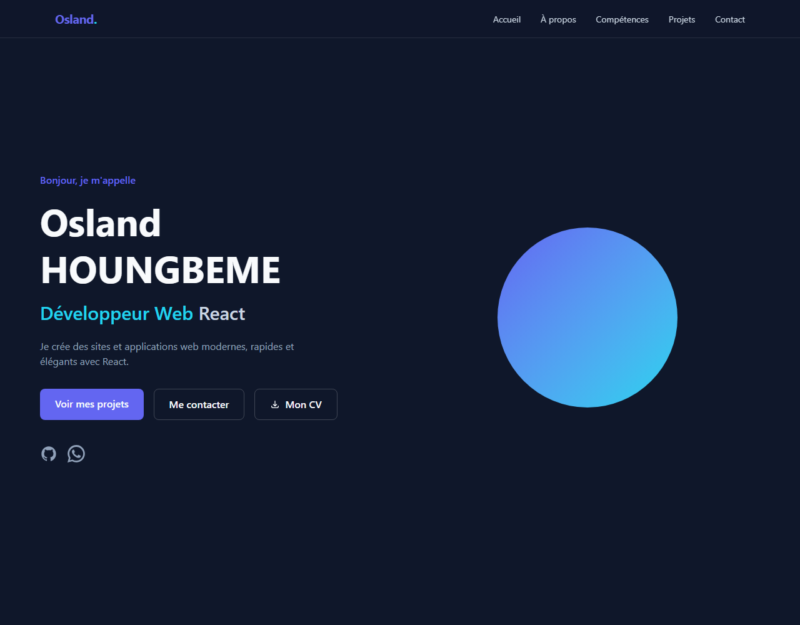

# Portfolio — Osland HOUNGBEME

<p align="center">
  
</p>

Bienvenue sur le dépôt de mon portfolio personnel. Il s'agit d'une application web moderne, rapide et entièrement responsive, conçue pour présenter mon profil, mes compétences et mes projets sur tout type d'écran (Android, iPhone, tablette, ordinateur).

## 📌 À propos

Portfolio personnel d'**Osland HOUNGBEME**, développeur web passionné actuellement en 3ᵉ année de Licence en Informatique à l'Université GASA Formation (Cotonou, Bénin). Je crée des sites et applications web modernes, rapides et élégants avec **React**.

## 🚀 Fonctionnalités

- 🌗 Design sombre moderne et élégant
- 📱 **100 % responsive** — optimisé mobile, tablette et desktop (menu hamburger, grilles adaptatives, safe-areas iOS)
- 📄 Téléchargement direct du **CV en PDF**
- 📲 Bouton **WhatsApp** pour un contact rapide
- 🧭 Navigation fluide par sections (Accueil, À propos, Compétences, Projets, Contact)
- ✉️ Formulaire de contact fonctionnel (FormSubmit)

## 🧰 Technologies utilisées

| Technologie   | Rôle                                |
|---------------|-------------------------------------|
| **React 19**  | Interface utilisateur               |
| **Vite**      | Bundler / serveur de développement  |
| **Tailwind CSS 4** | Styles et design system        |
| **JavaScript**| Logique applicative                 |

## 📁 Structure du projet

```
├── public/
│   ├── cv/                # CV (PDF)
│   └── favicon.svg
├── src/
│   ├── assets/            # Images (photo, aperçus de projets)
│   ├── components/        # Sections UI (Navbar, Hero, About, Skills, ...)
│   ├── data/
│   │   └── portfolio.js   # Toutes les données (profil, compétences, projets)
│   ├── App.jsx
│   ├── index.css          # Tailwind + thème
│   └── main.jsx
├── index.html
├── package.json
└── vite.config.js
```

## 🚧 Installation et démarrage

```bash
# 1. Cloner le dépôt
git clone https://github.com/oslandamiral-bit/Portfolio.git

# 2. Installer les dépendances
cd Portfolio
npm install

# 3. Lancer le serveur de développement
npm run dev
```

Le site sera disponible à l'adresse indiquée dans la console (généralement `http://localhost:5173`).

## 📦 Build de production

```bash
npm run build      # génère le dossier dist/
npm run preview    # prévisualise le build
```

## 👤 Contact

- 📧 Email : [oslandamiral@gmail.com](mailto:oslandamiral@gmail.com)
- 💬 WhatsApp : [+229 99 07 59 12](https://wa.me/22999075912)
- 🐙 GitHub : [oslandamiral-bit](https://github.com/oslandamiral-bit)

## 📄 Licence

Ce projet est un portfolio personnel. Vous pouvez vous en inspirer pour créer le vôtre, mais merci de ne pas le réutiliser tel quel à des fins commerciales sans autorisation.
